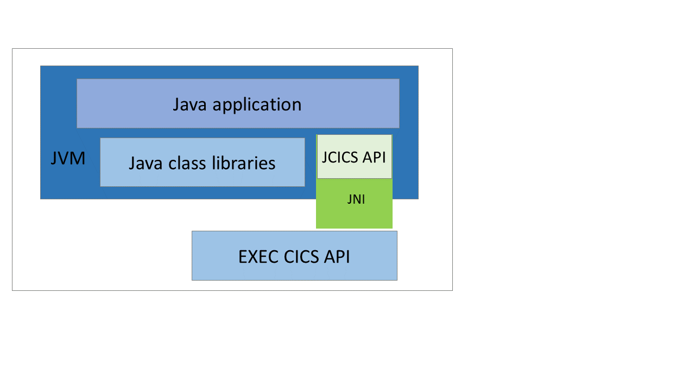
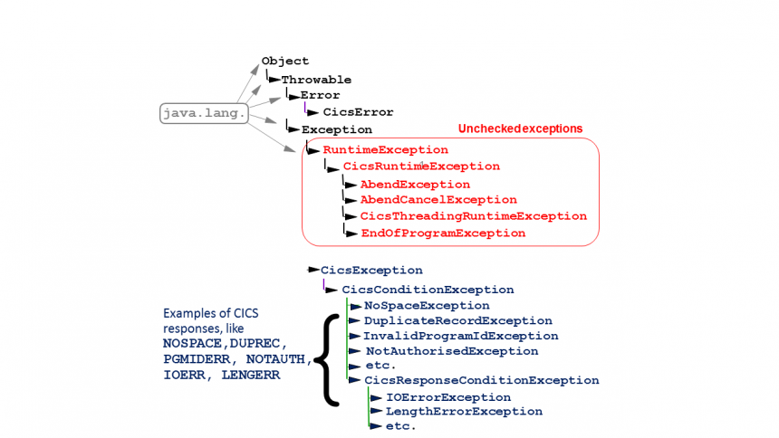

# Getting to grips with JCICS


JCICS provides a simple object hierarchy for accessing the CICS API from Java, and is similar to the EXEC CICS command API supported for other languages such as COBOL or assembler. Unlike other CICS high level languages, no translation step is necessary during compilation as the underlying EXEC CICS calls are dynamically generated via the Java Native Interface (JNI). JCICS is a fairly simple API and if you understand the EXEC CICS API and have some knowledge of Java then its a small jump to make. This does mean its not as object oriented as it could be, so if you have an OO outlook on life you may need to bite your tongue at times.



The following tutorial summarizes how to use the most popular parts of the JCICS API within CICS Java programs for deployment to an OSGi JVM server. You can also use JCICS in a Web application deployed into a Liberty JVM server in integrated mode, and the code samples provided are equally applicable to this environment..

# Application development

The JCICS API is provided in the com.ibm.cics.server.jar library in the $USSHOME/lib directory on zFS, however, it is also integrated into the [CICS Explorer](https://developer.ibm.com/cics/category/cics-explorer/) SDK for Java which can be installed into an Eclipse development environment and provides all the function needed to easily develop JCICS applications on a workstation and deploy onto the zFS filing system on z/OS. The JCICS API can be used in any CICS JVM server environment including both OSGi and Liberty JVM servers. In this article we show how to create components for an OSGi JVM server that can be linked to from other CICS programs, but the samples provided can easily be reused in a Java EE web application for deployment into a Liberty JVM server.

At the last count there were around 80 different classes that map to the underlying CICS commands or variants thereof, and you can view the full set in the online [Javadoc](http://www.ibm.com/support/knowledgecenter/SSGMCP_5.3.0/com.ibm.cics.ts.jcics.javadoc/overview-tree.html). Most JCICS classes have a one to one relationship with the EXEC CICS API commands but this is not always the case. The most commonly used JCICS classes are Task, Program, Channel, Container, TSQ, TDQ and KSDS and we will give an overview of how to use these within a CICS Java program for deployment into an OSGi JVM server.

| Class | Function |
| --------- | -------- |
| Task | Represents the CICS task |
| Program | Provides the ability to LINK to other CICS programs |
| Channel and Container | Support for CICS channels and containers |
| TSQ | Access to CICS temporary storage queues |
| TDQ | Access to CICS transient data queues |
| KSDS | Access to VSAM KSDS files |

> There is no support for the CICS Systems Programming interface (SPI) such as `EXEC CICS INQUIRE` or `SET` commands and so Java applications that need to use these commands should link to non\-Java components to perform SPI commands

## Tasks and programs

Lets first take a look at the two classes you are most likely to need *Task* and *Program*. The Program class maps to the [EXEC CICS LINK](http://www.ibm.com/support/knowledgecenter/SSGMCP_5.3.0/com.ibm.cics.ts.applicationprogramming.doc/commands/dfhp4_link.html) command and its variants, and the Task class maps to the [](http://www.ibm.com/support/knowledgecenter/SSGMCP_5.3.0/com.ibm.cics.ts.applicationprogramming.doc/commands/dfhp4_assign.html)[ASSIGN](http://www.ibm.com/support/knowledgecenter/SSGMCP_5.3.0/com.ibm.cics.ts.applicationprogramming.doc/commands/dfhp4_assign.html) and [ADDRESS](http://www.ibm.com/support/knowledgecenter/SSGMCP_5.3.0/com.ibm.cics.ts.applicationprogramming.doc/commands/dfhp4_address.html) commands but also provides a set of helper methods to access the EIB and to control syncpoints and abends, but more about this later.

The following code snippet shows how to use Task and Program to link to another CICS program, and is described in more detail using the line numbers below. A full working example is available in the [LinkProg1](https://github.com/cicsdev/cics-java-jcics-samples/blob/master/projects/com.ibm.cicsdev.link/src/com/ibm/cicsdev/link/LinkProg1.java) sample.


```java
private static final String PROG_NAME = "EC01";
private static final int CA_LEN = 18 ; 
....
public static void main(String[] args)
{
...
    Task task = Task.getTask();
    task.out.println("Hello world");
 
    Program prog = new Program();
    prog.setName(PROG_NAME);
    prog.setSyncOnReturn(false);  
    byte[] ca = new byte[CA_LEN];
    prog.link(ca);
```


Lines **1\-2.** Initialize constants including name of CICS program and length of COMMAREA input   
Line **4.** The `main(String[] args)` constructor signifies this as the entry point for this CICS program, which allows this class to be named in the CICS\-MainClass header in the OSGi bundle manifest   
Line **7.** Get the Task object representing the CICS task which the current Java thread is using, this will drive the underlying CICS ASSIGN command on first usage   
Line **8.** Send output to the print writer which will be directed to either the user’s terminal or the stdout if there is no terminal   
Line **10.** Instantiate an instance of a Program, and then set properties such as the name and whether or not the LINK will use the SYNCONRETURN option   
Line **13.** Create a byte array and then pass this as input on the `Program.link()` method. This will drive an `EXEC CICS LINK` command to the CICS program named in line 11   
The COMMAREA will be passed as a byte array, which is an unstructured array of bytes of the specified length. Most CICS programs expect structured data as input and if you need to build a Java bean to map to this you can use the IBM Record Generator for Java or the Rational J2C Tools to build wrapper classes to map the records, see [Building Java records from COBOL with the IBM Record Generator for Java](https://developer.ibm.com/cics/2016/05/12/java-cics-using-ibmjzos/). Note, there is no return type from the `Program.link()` method, this is often the case in JCICS and instead the data is updated in situ within the referenced COMMAREA.   

The program that is invoked by a link command can also be written in Java, and in our case will be passed the COMMAREA as a simple byte array. A sample Java version of the EC01 CICS COBOL program is shown below which shows how to use the *CommAreaHolder* class to receive the byte array mapping to the COMMAREA. A full working example is available in the [LinkServEC01](https://github.com/cicsdev/cics-java-jcics-samples/blob/master/projects/com.ibm.cicsdev.link/src/com/ibm/cicsdev/link/LinkServEC01.java) sample.

```java
public class LinkServEC01 
{
    private static final int CA_LEN = 18 ;  
    private static final String CA_LEN_ABCODE = "LEN";
    private static final SimpleDateFormat dfTime = new SimpleDateFormat("dd/MM/yy HH:mm:ss");   
    private static final String CCSID = System.getProperty("com.ibm.cics.jvmserver.local.ccsid");
 
    public static void main(CommAreaHolder cah)  
    {
 
        Task task = Task.getTask();
 
        if (cah.getValue().length < CA_LEN )
        {
            task.abend(CA_LEN_ABCODE);          
        }
 
        Date timestamp = new Date();            
        byte ba[] = dfTime.format(timestamp).getBytes(CCSID);
        System.arraycopy (ba, 0, cah.getValue(), 0, ba.length);
		...
    }
```


Lines **3\-5.** Initialize constants   
Line **6.** Get the local encoding of the CICS region, this defaults to EBCDIC   
Lines **13\-16.** Check input array is long enough, and terminate the task using an abend if input is too short   
Lines **18\-19.** Build time string for return to caller   
Lines **20\-21.** Create byte array from the time string using the CICS encoding and copy into the CommAreaHolder for return to the calling program as the COMMAREA   

## Exception handling

In Java errors that extend the *Exception* class are known as checked exceptions and must either be caught or declared as part of the method signature using the throws keyword. Any Java code which calls a method declared as throwing a checked exception must either provide logic to catch the checked exception, or add the exception to it’s own method signature, in order to propagate the exception further up the stack. The constraints on checked exceptions are enforced at compile time, and failure to adhere to the specification will result in a compilation error.

By contrast in traditional high level languages such as COBOL, when a CICS command returns an error (such as unknown program on a link), then it will return a response code (PGMIDERR) to the application using the data area supplied in the RESP parameter of the CICS command . This enables the application to handle or ignore errors on a call by call basis.

```cobol
EXEC CICS LINK PROGRAM('ECIPROG') RESP(RESP)    
        END-EXEC                                 
IF RESP = DFHRESP(INVREQ)                      
  .......                               
END-IF
```

In Java things are pretty similar as just about all JCICS commands can throw sub classes of the checked *CICSConditionException*, which represent error response codes from the underlying EXEC CICS commands. For a INVREQ this maps to an InvalidRequestException which looks like this in the class hierarchy.

```java
java.lang.Exception
  com.ibm.cics.server.CicsException
    com.ibm.cics.server.CicsConditionException
      com.ibm.cics.server.CicsResponseConditionException
        com.ibm.cics.server.InvalidRequestException
```

Now let’s see how this can be used in our `Program.link()` call. Each sub class of `CicsConditionException` can be individually caught so specific errors can be actioned or ignored.
Order is important, a compilation error is displayed if a catch clause for a more generic exception appears before a catch clause for a more specific one (that is, for one of its subclasses). In our example we just log a message for the `InvalidRequestException` and carry on processing. Note this means the transaction will continue normal processing and thus potentially commit any recoverable data, so make sure you don’t do this for fatal errors. We then catch all other CICS errors (**17**) and throw them up the stack using a new `RuntimeException` to drive subsequent error handling, which by default will abend the CICS task and rollback the transaction, but more about that later.

```java
task task = Task.getTask();
task.out.println("Hello world");
 
try    
{   
        Program prog = new Program();
        prog.setName(PROG_NAME);
        prog.setSyncOnReturn(false);  
        byte[] ca = new byte[CA_LEN];
        prog.link(ca);
 
}
catch (InvalidRequestException ire) 
{
    task.out.println("Invalid request on link - INVREQ");
} 
catch (CicsConditionException cce) 
{
    throw new RuntimeException(cce);
}
```

## Channels and containers

The other method of passing data from one CICS program to another is by using channels and containers. A channel is an interface between programs, it typically holds one or more containers to be passed between the programs. A container is a named data area. Channels and containers offer the advantage that more than 32KB of data can be passed, and both character and binary data can be specified. Character data (or strings in Java terms) is automatically converted at the API level, whereas binary data (or a byte array in Java terms) is flowed unconverted. By contrast, COMMAREAs are confined to a 32KB limit and are unstructured byte arrays. Multiple containers can be passed between programs within a channel, providing a high degree of flexibility about how to structure data.

The following abbreviated code snippet shows how to use channels and containers to pass a character string input container on a LINK and then to retrieve and read both a character string and a binary container. A full working example is available in the [LinkProg3](https://github.com/cicsdev/cics-java-jcics-samples/blob/master/projects/com.ibm.cicsdev.link/src/com/ibm/cicsdev/link/LinkProg3.java) sample and the corresponding back end program is available at [LinkServEduchan](https://github.com/cicsdev/cics-java-jcics-samples/blob/master/projects/com.ibm.cicsdev.link/src/com/ibm/cicsdev/link/LinkServEduchan.java).


```java
	
        private static final String PROG_NAME = "EDUCHAN";
        private static final String CHANNEL="EDUCHAN";
        private static final String INPUT_CONTAINER="INPUTDATA";
        private static final String DATE_CONTAINER="CICSTIME";
        private static final String CICSRC_CONTAINER="CICSRC";
        private static final String INPUTSTRING="Hello from Java";
....
 
        Task task = Task.getTask();
        Program prog = new Program();
        prog.setName(PROG_NAME);
....
 
        Channel testChannel = task.createChannel(CHANNEL);
        Container inputContainer = testChannel.createContainer(INPUT_CONTAINER);
        inputContainer.putString(INPUTSTRING);
 
        prog.link(testChannel);
 
        Container charContainer = testChannel.getContainer(DATE_CONTAINER);
        if (charContainer!=null)
        {
            resultStr = charContainer.getString();
        }
 
        Container bitContainer = testChannel.getContainer(CICSRC_CONTAINER);
        if (bitContainer!=null)
        {
            byte[] ba = bitContainer.get();
            ByteBuffer bb = ByteBuffer.wrap(ba);                    
            cicsrc = bb.getInt();   
        
```


Lines **1\-6.** Initialize constants to define program name, and container data and names.   
Line **14.** Create a `Channel` object which will be associated with the task.   
Lines **15\-16.** Create the input container named `INPUTDATA`, the `createContainer()` method signature takes the String *Hello from Java* as input which will cause CICS to create a character based container as opposed to a binary container. The encoding of this data will be stored internally in UTF\-16 when created in Java in order to handle the Unicode String data, and will be automatically converted to the local EBCDIC encoding if read from a COBOL program.   
Line **18.** Pass the channel as a reference on the `Program.link()` method, our invoked program [EDUCHAN](https://github.com/cicsdev/cics-java-jcics-samples/blob/master/src/Cobol/EDUCHAN.cbl) will receive the `INPUTDATA` container, and will reverse the input data, and return the formatted time in a character container along with an integer return code in a binary container.   
Lines **20\-23.** Create a new container object `charContainer` and get the character container defined as CICSTIME from the channel. This will return null (rather than throw a CICSConditionException which is the usual JCICS error model) if it does not exist, so we first test for null before reading the string data from it using the `Container.getString()` method.   
Lines **26\-32.** Create a new container object `bitContainer` and get the binary container defined as CICSRC from the channel. Again this could return null if its not present so we first test for null. Next we create a byte array and get the data from the `bitContainer`. The data is actually a 32\-bit integer from a CICS response code, so we need to wrap this into a `ByteBuffer` and then read the integer from this.   

## TS and TD queues

A temporary storage (TS) queue is a set of data items that can be read and reread in any sequence. TSQ resources can be dynamically created at runtime, unlike transient data (TD) queues that must be defined in advance.

The following snippets show how to use the *TSQ* class to write string data to a TSQ and then read it back using a JCICS holder. A full working example of this code available in the [TSQExample2](https://github.com/cicsdev/cics-java-jcics-samples/blob/master/projects/com.ibm.cicsdev.tsq/src/com/ibm/cicsdev/tsq/TSQExample2.java) sample.

```java
public class TSQExample2 extends TSQCommon
{
    private static final String TSQ_NAME = "MYTSQ";
    private static final int DEPTH_COUNT = 5;
    private static final String CCSID = System.getProperty("com.ibm.cics.jvmserver.local.ccsid");
 
    public static void main(String[] args)
    {
        TSQ tsq = new TSQ();
        tsq.setName(TSQ_NAME);
        tsq.setType(TSQType.MAIN);    
 
        for (int i = 1; i <= DEPTH_COUNT; i++) 
        {
             
            String msg = MessageFormat.format("TSQ write from JCICS item {0}", i);
            byte[] data;        
            try
            {
                data = msg.getBytes(CCSID);
            }
            catch (UnsupportedEncodingException uee) 
            {
                throw new RuntimeException(uee);
            }
            try {
                this.tsq.writeItem(data);
            }
            catch (CicsConditionException cce) 
            {
                throw new RuntimeException(cce);
            }
        }
    }
```


Lines **3\-5.** Initialize constants
Lines **9\-11.** Create `TSQ` object and set TSQ name and storage type as MAIN (in memory)
Line **13.** Loop around writing multiple records to the TSQ
Lines **17\-21.** Create byte array from the input string using the CICS encoding
Line **27.** Write each item to the TSQ using the `TSQ.writeItem()` method

The following method `readFromQueue()` shows how to use a JCICS `ItemHolder` to read bytes from a TSQ.

```java
public void readFromQueue()
{
    ItemHolder holder = new ItemHolder();
     
    for (int i = 1; i <= DEPTH_COUNT; i++) 
    {
         
        try
        {
            this.tsq.readItem(i, holder);
        }
        catch (CicsConditionException cce) 
        {
            throw new RuntimeException(cce);
        }
 
        byte[] data = holder.getValue();    
        String strData;
        try
        {
            strData = new String(data, CCSID);
        }
        catch (UnsupportedEncodingException uee) 
        {
            throw new RuntimeException(uee);
        }
    ....           
    }
}    
```


Line **3.** Create a JCICS `ItemHolder` to be used to read bytes from the TSQ
Line **10.** Use the `TSQ.readItem()` method to loop around reading items from the TSQ into the ItemHolder, starting from an index of 1 as this is the first record in a TS queue >
Line **17.** Extract the byte array from the item holder
Line **21.** Create a new string using the CICS encoding

Writing data to a TD queue is similar to TS and a set of examples is provided in the [com.ibm.cicsdev.tdq](https://github.com/cicsdev/cics-java-jcics-samples/tree/master/projects/com.ibm.cicsdev.tdq) project.

## VSAM files

VSAM is a high performance file storage access method widely used in CICS applications. There are 3 different types of VSAM files, key\-sequenced, entry\-sequence and relative record. In this article we will just cover the most popular type the key\-sequenced data set (KSDS) which is represented in JCICS via the *KSDS* class.

The following snippets show how to use the KSDS class to read and write structured records to VSAM file. In this example a `StockPart` record is used to represent the structured record, and was created from a COBOL copybook structure using the [JZOS record generation](https://developer.ibm.com/cics/2016/05/12/java-cics-using-ibmjzos/) tool. A full working example of this code is available in the [KsdsExample1](https://github.com/cicsdev/cics-java-jcics-samples/tree/master/projects/com.ibm.cicsdev.vsam/src/com/ibm/cicsdev/vsam/ksds) sample which extends the class KsdsExampleCommon.

```java
private static final String FILE_NAME = "XMPLKSDS";
private final KSDS ksds;
....
 
public void addRecord(StockPart sp)
{
    this.ksds = new KSDS();
    this.ksds.setName(FILE_NAME);  
    byte[] record = sp.getByteBuffer();
     
    byte[] key = StockPartHelper.getKey(sp);
     
    try
    {     
        this.ksds.write(key, record);
    }
    catch (DuplicateRecordException dre) 
    {  // Collision on the generated key
        String strMsg = "Tried to insert duplicate key 0x%08X"; 
        Task.getTask().out.println( String.format(strMsg, sp.getPartId()) );
        throw new RuntimeException(dre);
    }
    catch (InvalidRequestException ire) 
    {            
        if ( ire.getRESP2() == 20 ) // File not addable
        { 
            String strMsg = "Add operations not permitted for file %s";
            Task.getTask().out.println( String.format(strMsg, this.ksds.getName()) );
        }            
        // Throw an exception to rollback the current UoW
        throw new RuntimeException(ire);
    }
    catch (CicsConditionException cce) 
    {         
        throw new RuntimeException(cce);
    }
}
```


Line **9.** Get the byte structure from the generated record using the getByteBuffer() method on the StockPark record   
Line **11.** Create a byte array containing the key for this record   
Line **15.** Write the record into the VSAM file using the specified key   
Lines **17&23.** Catch specific responses from the WRITE FILE commmand   
Line **33.** Catch all other responses and throw an exception to abend the task   

## Unchecked exceptions, abends and rollbacks

In Java unexpected error conditions are represented by Java classes which extend the `RuntimeException` class, and are known as *unchecked exceptions*. Unchecked exceptions are not subject to the compile time checking mandated for checked exceptions, although they can be caught if required. There are only a few unchecked exceptions in the JCICS API, and they all extend the `CICSRuntimeException` class.



All of these unchecked exceptions that extend `CICSRuntimeException` represent conditions within CICS that should **not** generally be handled by an application. Java code running in CICS should not catch these exceptions without re\-throwing them, either explicitly in a catch block, or implicitly by catching a superclass of these exceptions such as `Exception` or `Throwable` as shown below.

```java
try
{
    ...
} 
catch ( Exception e ) 
{
    ...
}   
```


Instead, they should be allowed to propagate out of the Java environment and back to CICS, where the task will abend. Note, included in this list is `AbendException` which represents an abend of a CICS task, and should only be caught if you wish to develop your own Java abend handling routine and re\-throw the Exception. If a Java exception such as a null pointer exception is allowed to propagate out of the Java code and back to the JVM server runtime, this is generally surfaced as one of the CICS abends prefixed with AJ. Most commonly, an uncaught exception will result in an AJ04 abend, and the transaction will be rolled\-back. The following snippet shows how to catch and log both trivial exceptions, CICS abends and other unchecked exceptions.


```java
try
{
...
}  
catch (TrivialException te) 
{ 
    LOGGER.warn();  
}  
catch (AbendException ae) 
{ 
    LOGGER.warn("CICS Abend:" ae.getABCODE() + " Task:" + Task.getTask().getTaskNumber() );  
    throw ae; 
}  
catch (Exception e) 
{ 
    LOGGER.warn(); 
    throw e; 
} 
```

It is also possible for a Java application to rollback the CICS transaction or abend the CICS task directly. This can be achieved using the `Task.abend()` or `Task.rollback(`) methods in the Task class, as shown in the LinkServEC01 sample. Abending the CICS task is similar in concept to the throwing of Java exception, as it allows a CICS abend handler written in COBOL (or another language) to take control of error processing.


```java
Task.getTask().abend(ABCODE)

```

The various forms of the `Task.abend()` method allow an application to optionally specify an abend code or whether a dump is required. The forceAbend() methods provide the same options as the equivalent abend methods, but are equivalent to specifying the CANCEL keyword on the EXEC CICS ABEND command. Invoking a force abend method will always terminate the task abnormally, and overrides any existing CICS abend handlers that have been established for the task.

Rolling back the transaction is equivalent to issuing an `EXEC CICS SYNCPOINT ROLLBACK` command, and will allow the task to continue but rollback all the updates that have taken place so far in the current unit\-of\-work. In JCICS this is achieved using the `Task.rollback()` method as shown below.


```java
try
{
    Task.getTask().rollback();
} 
catch (InvalidRequestException ire) 
{
    .....
}  
```


> **Note**: When accessing resources controlled by the Liberty transaction manager, such as a remote DB2 database using JDBC type 4 connectivity then it is necessary to use the Java transaction API (JTA) to create a Java transaction to control the global transaction scope, including the subordinate CICS unit\-of\-work. In this case it is not possible to use the `Task.rollback()` method and instead the JTA API should be used. For further details refer to this article [Using Java Transaction in CICS Liberty to coordinate JDBC updates](https://github.com/cicsdev/blog-cics-java-jta-jdbc/blob/master/blog.md).

---

### Reference materials

All the sample code for this tutorial is available at the following CICSDev GitHub repository [cics\-java\-jcics\-samples](https://github.com/cicsdev/cics-java-jcics-samples).

For a more detailed discussion of JCICS and how to use it to integrate Java applications with CICS programs refer to the following Video Education course [Extending a CICS web application using JCICS](http://www.redbooks.ibm.com/redbooks.nsf/redbookabstracts/crse0302.html?Open)
